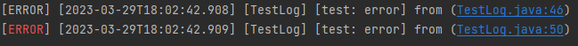
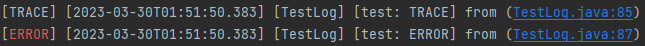

[](https://maven-badges.herokuapp.com/maven-central/org.nishat.util/log)

# Introduction

A flexible Logging system that allows to create custom log and write via callback which makes it more flexible to use.

# installing

All installing methods will be found at [repository](https://repo1.maven.org/maven2/org/nishat/util/log/). Here are some
common methods:

### Maven

```xml

<dependency>
    <groupId>org.nishat.util</groupId>
    <artifactId>log</artifactId>
    <version>1.5.18</version>
</dependency>
```

### Gradle

```text
implementation 'org.nishat.util:log:1.5.18'
```

# Use Case

## Log Levels

```java
        Log.i("test",LogLevel.INFO.toString());
        Log.t("test",LogLevel.TRACE.toString());
        Log.d("test",LogLevel.DEBUG.toString());
        Log.a("test",LogLevel.ALERT.toString());
        Log.w("test",LogLevel.WARNING.toString());
        Log.c("test",LogLevel.CRITICAL.toString());
        Log.e("test",LogLevel.ERROR.toString());
        Log.f("test",LogLevel.FATAL.toString());
        Log.raw("test", "raw"); //This type is for general use
```

Outputs:

```text
[INFO] [2023-03-29T17:33:18.123] [TestLog] [test: INFO] from (TestLog.java:29)
[TRACE] [2023-03-29T17:33:18.124] [TestLog] [test: TRACE] from (TestLog.java:30)
[DEBUG] [2023-03-29T17:33:18.124] [TestLog] [test: DEBUG] from (TestLog.java:31)
[ALERT] [2023-03-29T17:33:18.124] [TestLog] [test: ALERT] from (TestLog.java:32)
[WARNING] [2023-03-29T17:33:18.125] [TestLog] [test: WARNING] from (TestLog.java:33)
[CRITICAL] [2023-03-29T17:33:18.125] [TestLog] [test: CRITICAL] from (TestLog.java:34)
[ERROR] [2023-03-29T17:33:18.125] [TestLog] [test: ERROR] from (TestLog.java:35)
[FATAL] [2023-03-29T17:33:18.125] [TestLog] [test: FATAL] from (TestLog.java:36)
[test] [2023-03-30T02:19:29.770] [TestLog] [test: raw] from (TestLog.java:66)
```

## Configuration

Configuration can be declared both globally and locally. Global declaration will be effective to all `Log` calls unless
any local declaration found for any particular configuration field.

### Global Configuration

#### Color

```java
        Log.e("test","error"); //default colored text

        //configure log
        GlobalLogConfig.LOG_COLOR=true;
        Log.e("test","error"); //red colored type text
```

Outputs



#### Visibility

```java
        //default LogLevel.INFO
        Log.d("test",LogLevel.DEBUG.toString()); //visible
        Log.e("test",LogLevel.ERROR.toString()); //visible

        //configure log
        GlobalLogConfig.LOG_LEVEL=LogLevel.WARNING;
        Log.d("test",LogLevel.DEBUG.toString()); // invisible
        Log.e("test",LogLevel.ERROR.toString()); //visible
```

Outputs

```text
[DEBUG] [2023-03-29T18:12:03.154] [TestLog] [test: DEBUG] from (TestLog.java:42)
[ERROR] [2023-03-29T18:12:03.154] [TestLog] [test: ERROR] from (TestLog.java:43)
[ERROR] [2023-03-29T18:12:03.154] [TestLog] [test: ERROR] from (TestLog.java:48)
```

#### Format

```java
        //default Format: "["+LogProperties.LEVEL+"] ["+LogProperties.TIMESTAMP+"] ["+LogProperties.PACKAGE+"] ["+LogProperties.INDEX+": "+LogProperties.VALUE+"] from ("+LogProperties.FILE+":"+LogProperties.LINE+")"
        Log.e("test","error");

        //configure log
        GlobalLogConfig.FORMAT=LogProperties.INDEX+": "+LogProperties.VALUE;
        Log.e("test","error");
```

Outputs

```text
[ERROR] [2023-03-29T19:06:31.916] [TestLog] [test: error] from (TestLog.java:64)
test: error
```

#### Output Writer
```java
        //default new PrintWriter(System.out);
        Log.e("test", "error");

        //configure log
        FileWriter fw= new FileWriter("test-out.txt");
        GlobalLogConfig.WRITER = fw; //any kind of Writer can be configured here
        //as we configured text file we also should set color to false
        GlobalLogConfig.LOG_COLOR = false;
        Log.e("test", "error");
        Log.e("test", "error1");
        Log.e("test", "error2");
        Log.e("test", "error3");
        fw.close();
```
Outputs \
console
```text
[ERROR] [2023-03-29T20:23:23.780] [TestLog] [test: error] from (TestLog.java:75)
```
File `test-out.txt`
```text
[ERROR] [2023-03-29T20:23:23.781] [TestLog] [test: error] from (TestLog.java:82)
[ERROR] [2023-03-29T20:23:23.782] [TestLog] [test: error1] from (TestLog.java:83)
[ERROR] [2023-03-29T20:23:23.782] [TestLog] [test: error2] from (TestLog.java:84)
[ERROR] [2023-03-29T20:23:23.782] [TestLog] [test: error3] from (TestLog.java:85)
```

### Local Configuration
#### Color
```java
        LocalLogConfig config = new LocalLogConfig();
        config.LOG_COLOR = false;
        Log.t("test", LogLevel.TRACE.toString(), config); //default colored text
        config.LOG_COLOR = true;
        Log.e("test", LogLevel.ERROR.toString(), config); //red colored type text
```
Outputs




#### Visibility
```java
        LocalLogConfig config = new LocalLogConfig();
        config.LOG_LEVEL = LogLevel.DEBUG;
        Log.t("test", LogLevel.TRACE.toString(), config); // invisible
        Log.d("test", LogLevel.DEBUG.toString(), config); //visible
        Log.a("test", LogLevel.ALERT.toString(), config); //visible
        config.LOG_LEVEL = LogLevel.CRITICAL;
        Log.w("test", LogLevel.WARNING.toString(), config); // invisible
        Log.c("test", LogLevel.CRITICAL.toString(), config); //visible
        Log.e("test", LogLevel.ERROR.toString(), config); //visible
```

Outputs
```text
[DEBUG] [2023-03-30T01:55:07.260] [TestLog] [test: DEBUG] from (TestLog.java:67)
[ALERT] [2023-03-30T01:55:07.261] [TestLog] [test: ALERT] from (TestLog.java:68)
[CRITICAL] [2023-03-30T01:55:07.261] [TestLog] [test: CRITICAL] from (TestLog.java:71)
[ERROR] [2023-03-30T01:55:07.262] [TestLog] [test: ERROR] from (TestLog.java:72)
```
#### Format
```java
        LocalLogConfig config = new LocalLogConfig();
        config.FORMAT = "["+LogProperties.TIMESTAMP+"] "+LogProperties.INDEX+": "+LogProperties.VALUE;
        Log.t("test", LogLevel.TRACE.toString(), config);
        config.FORMAT = null; //global format
        Log.e("test", LogLevel.ERROR.toString(), config);
```
Outputs
```text
[2023-03-30T01:59:55.332] test: TRACE
test: ERROR
```
#### Output Writer
```java
        //configure log
        FileWriter fw1= new FileWriter("test-out.txt");
        LocalLogConfig config = new LocalLogConfig();
        config.WRITER = fw1;
        //as we configured text file we also should set color to false
        config.LOG_COLOR = false;
        Log.e("test", "error0", config);
        Log.e("test", "error1", config);
        Log.e("test", "error2", config);
        Log.e("test", "error3", config);
        fw1.close();
```
Output to File `test-out.txt`
```text
[ERROR] [2023-03-30T02:09:05.625] [TestLog] [test: error0] from (TestLog.java:128)
[ERROR] [2023-03-30T02:09:05.626] [TestLog] [test: error1] from (TestLog.java:129)
[ERROR] [2023-03-30T02:09:05.626] [TestLog] [test: error2] from (TestLog.java:130)
[ERROR] [2023-03-30T02:09:05.627] [TestLog] [test: error3] from (TestLog.java:131)
```


# Resources

- Maven repository: https://repo1.maven.org/maven2/org/nishat/util/log/
- Maven snapshots: https://s01.oss.sonatype.org/content/repositories/snapshots/org/nishat/util/log/

